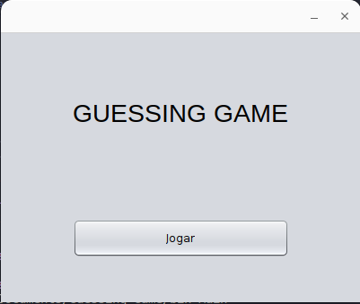

# Guessing Game

## Estrutura das pastas

O projeto contém uma pasta:

- `src` : a pasta que contém todo o código
  
  - `br.com.game.guessing`: pacote criado que possui a classe do jogo.

    - `GuessingGame.java`: classe que possui a lógica do jogo com a interface gráfica.
  
  - `Main.java`: classe Main que inicia o jogo quando o arquivo é executado.

> Este código tem a possibilidade de ser jogado via terminal, mude para `main`

## Como jogar

### Propósito

O jogo foi desenvolvido com interface gráfica utilizando o Swing, ao ser executado irá abrir uma janela onde o jogador deverá clicar em **Jogar**, o jogo sorteará um número aleatório que poderá ir de 1 até 100. O objetivo do jogo é acertar-lo em até 10 tentativas.

### Regras

1. **O jogador perde** caso esgote as tentativas de acertar o número.

2. **O jogador ganha** caso acerte o número secreto dentro do número de tentativas do jogo.

### Encerramento do jogo

O jogo se encerra ao clicar no botão de fechar (`X`) a qualquer momento do jogo.
